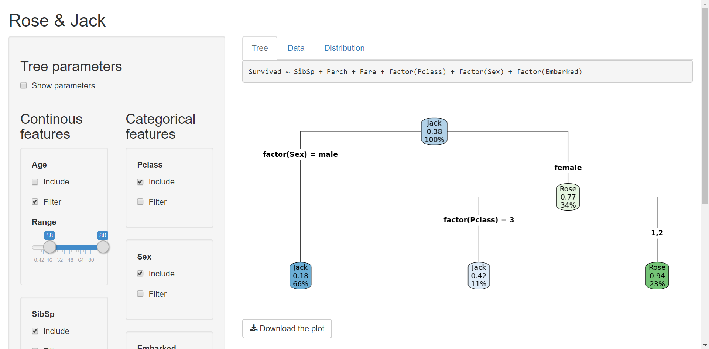

# RoseJack
Dynamic Decision tree



## Install and deploy
If used for the first time, install the dependencies:
```R
install.packages("shiny")
install.packages("ggplot2")
install.packages("rpart")
install.packages("stringr")
install.packages("dplyr")
install.packages("titanic")
install.packages("car")
install.packages("rpart.plot")
```

Then:
```R
shiny::runGitHub("HHoofs/RoseJack")
```

## User interface
### Side panel
There are three panes on the left side to provide input to the analysis:
* Tree parameters: Adjust the paramters for the decision tree
* Continous features: The continous features in the dataset, which can be *included* and/or used to *filter* the dataset
* Categorical features: The categorical features in the dataset, which can be *included* and/or used to *filter* the dataset

### Main panel
In the main panel there are three tabs which show various outputs:
* Tree: The decision tree, including a download button to save it as a pdf
* Data: The active data frame that is used for the current analysis
* Distribution: The overall distribution of the outcome